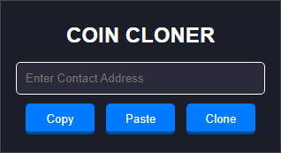

## Crypto Coin Cloner Chrome Extension
### Description
This chrome extension is used to clone crypto coins on the '**pump.fun**' website. It uses a contact address of a user selected crypto coin to fetch the data from the **PumpPortal API**. It then uses the selected coin's data to fill out a blank create coin form on a new page to create a new coin with the same details.

  

 

### Features
- Fetches coin data from the Pump Portal API using the provided contact address.
- Automatically fills out the form on the Pump.fun create page with the fetched data.
- Opens the coin icon link in a new tab.
- Copy and paste functionality for contact addresses.
- User-friendly interface for easy cloning.
### Code Explanation
- **'background.js'**: Handles background tasks such as fetching data from the API and storing it in local storage.
- **'content.js'**: Contains the script that runs on the Pump.fun create page to autofill the form.
- **'popup.js'**: Contains the logic for the popup interface, including event listeners for buttons.
- **'popup.html'**: The HTML structure for the extension's popup interface.
### Usage
When on  valid pump.fun page
### Installation
- Clone or download the repository.
- Open Chrome and navigate to chrome://extensions/.
- Enable "Developer mode" at the top right.
- Click "Load unpacked" and select the directory containing the extension files.
